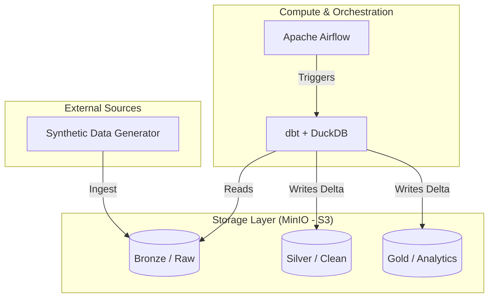

# 🚀 Local Data Lakehouse Project

Este proyecto implementa una arquitectura **Modern Data Stack** de grado empresarial, optimizada para un despliegue ligero y eficiente en un solo nodo (Arch Linux + Docker).

La filosofía central es **"Zero-Spark"**: Reemplazamos los pesados clústeres distribuidos por motores de nueva generación como **DuckDB** y el formato **Delta Lake**, logrando latencias analíticas mínimas sin la sobrecarga de la JVM.

---

## 🏗️ Arquitectura del Sistema



## 🛠️ Stack Tecnológico

| Componente | Tecnología | Propósito |
| :--- | :--- | :--- |
| **Almacenamiento** | [MinIO](https://min.io/) | Data Lake compatible con S3 para persistencia de objetos. |
| **Motor de Cómputo** | [DuckDB](https://duckdb.org/) | Motor OLAP en memoria para procesamiento ultrarrápido. |
| **Transformación** | [dbt](https://www.getdbt.com/) | Orquestación de lógica de negocio y linaje de datos. |
| **Formato de Tabla** | [Delta Lake](https://delta.io/) | Transacciones ACID y Time Travel sobre Parquet. |
| **Orquestador** | [Airflow](https://airflow.apache.org/) | Gestión de workflows y scheduling de pipelines. |

---

## 📂 Estructura Medallion (Path-Based)

El proyecto sigue el patrón de diseño **Medallion Architecture**:

1.  **Bronze (Raw)**: Datos crudos capturados directamente del origen. Formato Parquet para eficiencia.
2.  **Silver (Clean)**: Datos filtrados y normalizados. Implementado mediante **Python models** en dbt para garantizar la compatibilidad nativa con el protocolo Delta.
3.  **Gold (Business)**: Agregaciones finales y métricas listas para consumo (BI/ML). También persistido en formato Delta Lake.

---

## 🚀 Inicio Rápido

### 1. Levantar la Infraestructura
```bash
docker-compose up -d
```

### 2. Ejecutar Prueba de Concepto (PoC)
El script `run_poc.sh` automatiza la ingesta inicial y la ejecución de dbt:
```bash
./scripts/run_poc.sh
```

### 3. Acceso a Consolas
*   **Airflow UI**: [localhost:8080](http://localhost:8080) (admin/admin)
*   **MinIO Console**: [localhost:9001](http://localhost:9001) (admin/password123)

---

## 🧠 Conceptos Clave de esta Arquitectura

Para entender "cómo está el baile" en este proyecto, hay que entender la separación de roles:

### 1. El Almacén (MinIO)
Es el refrigerador. Aquí vive la "Verdad" en archivos **Parquet** y **Delta**. Si el motor explota, los datos están a salvo aquí.

### 2. El Catálogo (DuckDB `.duckdb`)
Es el **Menú del Restaurante**. No contiene la comida, pero contiene las descripciones, los precios y sabe exactamente en qué parte del refrigerador está cada ingrediente. 
*   En el mundo corporativo (Databricks), esto se llama **Unity Catalog**. 
*   En este proyecto, tu archivo `.duckdb` es tu **Unity Catalog Local**.

### 3. El Motor (DuckDB Engine)
Es el chef. Lee el menú (Catálogo), saca los ingredientes del refrigerador (MinIO), los cocina en la estufa (RAM) y te entrega el plato (Resultado del SQL).

### 4. El Orquestador de Lógica (dbt)
Es el **Libro de Recetas** y el **Capitán del Barco**. dbt no "toca" los datos, pero le dice a DuckDB exactamente en qué orden cocinar cada plato (`ref`). Él sabe que no puede haber "Gold" si antes no se terminó el "Silver".

---

## 💡 ¿Por qué esta arquitectura es "Guerra de Galaxias"?

*   **Desacoplamiento Total:** Puedes borrar el archivo `.duckdb` y no pierdes ni un solo dato. dbt lo reconstruirá en segundos.
*   **Escalabilidad Mental:** Estás aprendiendo exactamente cómo funciona Databricks o Snowflake, pero sin pagar la factura de la nube.
*   **Velocidad:** Al no guardar los datos dentro del motor, las consultas vuelan porque DuckDB solo procesa lo que necesita "bajo demanda".

---

## 🚀 Inicio Rápido

