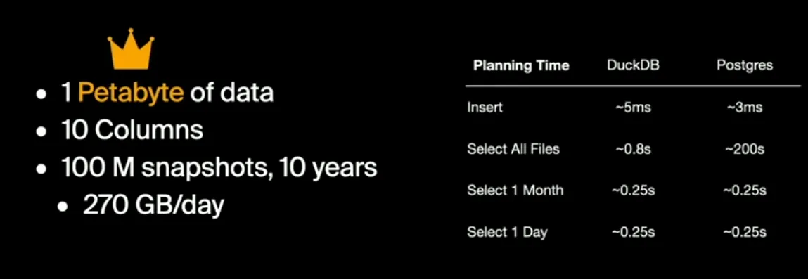
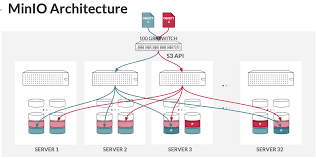
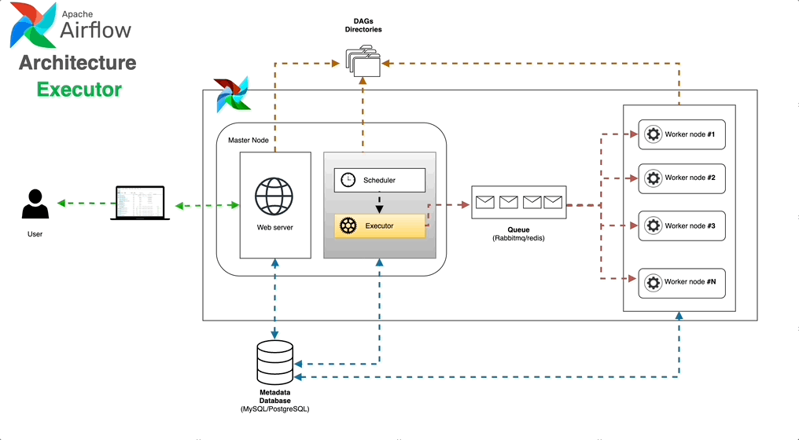

# Local DuckLake Project

Este proyecto implementa una arquitectura **DuckLake** de grado empresarial, optimizada para un despliegue ligero y eficiente en un solo nodo 

La filosofía central es **"Zero-Spark"**: Reemplazamos los pesados clústeres distribuidos por la arquitectura **DuckLake**, utilizando **DuckDB** con la extensión **DuckLake**, logrando latencias analíticas mínimas sin la sobrecarga de la JVM.

Esto proyecto es para demostrar la arquitectura DuckLake en accion y que en realidad puede servir para el **90%** de los casos reales.

A los creadores han afirmado que puede consultar petabytes de informacion en segundos, para mi esto suena a una locura pero lo mas probable es que tengan razon por lo que recomiendo que lo tengan en cuenta. 

**Nota**: Si bien DuckDB puede manejar grandes volúmenes de datos en memoria, el rendimiento real dependerá de la capacidad de la máquina (RAM y CPU). Para casos de uso con datos que excedan la capacidad de la máquina, se pueden explorar opciones de escalabilidad, como el uso de múltiples nodos o la integración con soluciones de almacenamiento distribuido.

Este proyecto se hizo en base al articulo de practical data enginering.
***https://www.pracdata.io/p/is-ducklake-a-step-backward***

---

## 🏗️ Arquitectura del Sistema

### Diagrama Técnico (Mermaid)

## 🛠️ Stack Tecnológico

| Componente | Tecnología | Propósito |
| :--- | :--- | :--- |
| **Almacenamiento** | [MinIO](https://min.io/) | Data Lake compatible con S3 para persistencia de objetos. |
| **Motor de Cómputo** | [DuckDB](https://duckdb.org/) | Motor OLAP en memoria para procesamiento ultrarrápido. |
| **Gestor de Metadatos**| [DuckLake](https://github.com/marcelosousa/ducklake) | Extensión de DuckDB para gestión de metadatos y almacenamiento (reemplaza Delta Lake). |
| **Transformación** | [dbt](https://www.getdbt.com/) | Orquestación de lógica de negocio y linaje de datos. |
| **Orquestador** | [Airflow](https://airflow.apache.org/) | Gestión de workflows y scheduling de pipelines. |

---

## 📂 Estructura Medallion (Path-Based)

El proyecto sigue el patrón de diseño **Medallion Architecture**:

1.  **Bronze (Raw)**: Datos crudos capturados directamente del origen. Gestionado por DuckLake (`raw_lake`).
2.  **Silver (Clean)**: Datos filtrados y normalizados. Implementado mediante modelos dbt materializados en DuckLake (`silver_lake`).
3.  **Gold (Business)**: Agregaciones finales y métricas listas para consumo. Persistido y catalogado en DuckLake (`gold_lake`).

---

## 🧠 Conceptos Clave de esta Arquitectura

Para entender "cómo está el baile" en este proyecto, hay que entender la separación de roles:

### 1. El Almacén (MinIO)
Es el refrigerador. Aquí viven los datos físicos en la nube (S3). Si el motor explota, los datos están a salvo aquí, organizados por los catálogos de DuckLake.

### 2. El Catálogo (DuckLake)
Es el **Menú del Restaurante**. No contiene la comida, pero contiene las descripciones, los precios y sabe exactamente en qué parte del refrigerador está cada ingrediente. 
*   En esta arquitectura, usamos la extensión **DuckLake** para gestionar múltiples catálogos (`raw_lake`, `silver_lake`, `gold_lake`) de forma independiente.
*   Esto permite desacoplar los metadatos del motor y facilita la gestión de ambientes multicanal.

### 3. El Motor (DuckDB + DuckLake Extension)
Es el chef. Lee el menú (DuckLake), saca los ingredientes del refrigerador (MinIO), los cocina en la estufa (RAM) y te entrega el plato (Resultado del SQL).

### 4. El Orquestador de Lógica (dbt)
Es el **Libro de Recetas** y el **Capitán del Barco**. dbt no "toca" los datos, pero le dice a DuckDB exactamente en qué orden cocinar cada plato (`ref`). Él sabe que no puede haber "Gold" si antes no se terminó el "Silver".

---

# Variables de entorno de ejemplo para el docker compose 

### Minio 
MinIO Configuration
MINIO_ROOT_USER=admin
MINIO_ROOT_PASSWORD=password123
AWS_ACCESS_KEY_ID=admin
AWS_SECRET_ACCESS_KEY=password123
AWS_REGION=us-east-1
S3_ENDPOINT=http://minio:9000

## 🏗️ Arquitectura de Minio
Se opto por usar Minio en lugar de S3 debido a que es un servicio gratuito y de código abierto que permite almacenar objetos en la **"nube"**, es totalmente compatible con la API de S3, por lo que se puede usar con las mismas herramientas y librerías que se usan con S3.

 --- 

### Airflow
Airflow Configuration
AIRFLOW_UID=1000
AIRFLOW_PROJ_DIR=./airflow
_AIRFLOW_WWW_USER_USERNAME=admin
_AIRFLOW_WWW_USER_PASSWORD=admin
_PIP_ADDITIONAL_REQUIREMENTS='duckdb==1.0.0 dbt-duckdb==1.8.0 pandas==2.2.2 deltalake==0.17.0 requests==2.31.0'

## 🏗️ Arquitectura de Airflow
Se opto por usar Airflow como orquestador debido a que es un servicio gratuito y de código abierto que permite orquestar flujos de trabajo, es totalmente compatible con la API de S3, por lo que se puede usar con las mismas herramientas y librerías que se usan con S3.

### PostgreSQL
PostgreSQL Configuration (used by Airflow & UC)
POSTGRES_USER=airflow
POSTGRES_PASSWORD=airflow
POSTGRES_DB=airflow

---
